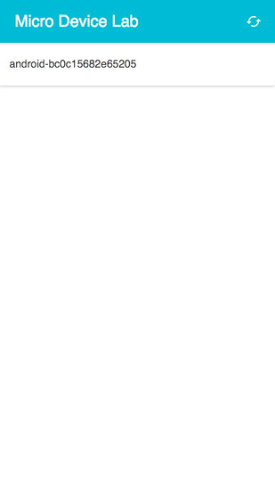

# Micro Device Lab

## What?

Micro Device Lab (µDL) is an application I made to help me quickly throttle the network connections of a number of mobile devices that're all connected to a Raspberry Pi wireless access point. The application runs on the Raspberry Pi, creating and deleting traffic control (TC) queuing disciplines and filters to manage round-trip time (RTT) and bandwidth for each device.

## Why?

I work with [the Reading Web née Mobile Web team](https://www.mediawiki.org/wiki/Reading/Web) at the [Wikimedia Foundation](https://wikimediafoundation.org) (WMF). The Reading deparment recently had an internal discussion about around how we might better understand users with low-end devices connected to low-bandwidth, unstable mobile networks, somewhat inspired by [Cade Metz's "Facebook Workers Ditch iPhones in Push for World Conquest"](http://www.wired.com/2015/10/facebook-workers-ditch-iphones-in-push-for-world-conquest/). During the discussion [**@dr0ptp4kt**](https://github.com/dr0ptp4kt) mentioned that at the WMF offices in San Francisco there's a wireless network that throttles the network connections of all connected devices to a 2G connection, or thereabouts. I, however, nearly always work in London.

## How?

µDL works by assigning traffic from the device to one of a set of pre-defined "network throttling profiles". Each profile is a combination of two TC queuing disciplines (qdiscs): a [Token Bucket Filter qdisc](http://lartc.org/howto/lartc.qdisc.classless.html#AEN690) that limits the rate at which packets are sent; and a [netem qdisc](http://www.linuxfoundation.org/collaborate/workgroups/networking/netem) that delays each packet before it is sent.

When a device has its network throttling profile changed, a [TC filter is created](http://lartc.org/howto/lartc.qdisc.filters.html) that matches packets from the device's IPv4 address and assigns them to a "flow" that corresponds to the profiles's first qdisc.

## Getting Started

First and foremost you'll need a Raspberry Pi wireless access point. [Download a Raspbian Jessie Lite image](https://www.raspberrypi.org/downloads/raspbian/) and [write it to an SD card](https://www.raspberrypi.org/documentation/installation/installing-images/); then follow [Lady Ada's "Setting up a Raspberry Pi as a WiFi access point"](https://learn.adafruit.com/setting-up-a-raspberry-pi-as-a-wifi-access-point) tutorial, which not only tells you how but how to debug common issues as well.

Both the µDL service and UI are written in JavaScript. You'll need to download and install [Node.js](https://nodejs.org). Fortunately, the latest stable release of Node.js is available to [download as pre-built ARMv6, ARMv7, or ARMv8 binaries](https://nodejs.org/en/download/stable/). If you're using a Raspberry Pi 1 Model A, Model A+, Model B, or Raspberry Pi Zero, then you should grab the ARMv6 binaries; whereas if, like me, you're using a Raspberry Pi 2 Model B, then you should download the ARMv7 binaries.

Now that you've got your Raspberry Pi all set up, you can install, setup, and run µDL on it with the following commands:

    git clone https://github.com/phuedx/micro-device-lab.git
    cd micro-device-lab
    ./script/setup
    ./script/server

## Resources

I've referred to the following while piecing together µDL:

* [tc(8)](http://man7.org/linux/man-pages/man8/tc.8.html)
* [Linux Advanced Routing & Traffic Control HOWTO](http://lartc.org/howto/index.html)
* [netem](http://www.linuxfoundation.org/collaborate/workgroups/networking/netem)
* [tc Packet Filtering and netem](http://tcn.hypert.net/tcmanual.pdf), which was indispensible when I was fixing [#4: Existing filters aren't deleted](https://github.com/phuedx/micro-device-lab/issues/4)

## Feedback

Your thoughts and comments are, of course, always welcome. In descending order of responsiveness, you can:

* [PM me on IRC](https://webchat.freenode.net/),
* [create an issue on GitHub](https://github.com/phuedx/micro-device-lab/issues/new), or
* [tweet at me on Twitter](https://twitter.com/phuedx)

## Shout-outs

I wouldn't have built µDL without [**@joakin**](https://github.com/joakin)'s support and couldn't have without his initial review.

## License

Micro Device Lab is [MIT-licensed](./LICENSE).
